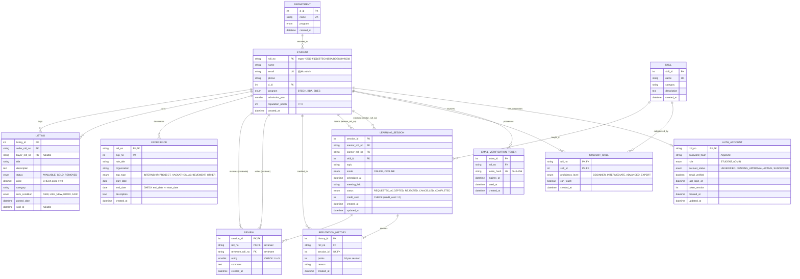

# Entity-Relationship (ER) Model — SkillSwap JKLU

```mermaid
erDiagram
    DEPARTMENT ||--o{ STUDENT : "enrolled_in"
    STUDENT ||--o| AUTH_ACCOUNT : "has_credentials"
    STUDENT ||--o{ EMAIL_VERIFICATION_TOKEN : "receives"
    STUDENT ||--o{ STUDENT_SKILL : "possesses"
    SKILL ||--o{ STUDENT_SKILL : "categorized_by"
    
    STUDENT ||--o{ LEARNING_SESSION : "mentors (mentor_roll_no)"
    STUDENT ||--o{ LEARNING_SESSION : "learns (learner_roll_no)"
    SKILL ||--o{ LEARNING_SESSION : "taught_in"

    LEARNING_SESSION ||--o| REPUTATION_HISTORY : "rewards"
    STUDENT ||--o{ REPUTATION_HISTORY : "credited_to"

    LEARNING_SESSION ||--o{ REVIEW : "evaluated_in"
    STUDENT ||--o{ REVIEW : "writes (reviewer)"
    STUDENT ||--o{ REVIEW : "receives (reviewee)"

    STUDENT ||--o{ EXPERIENCE : "documents"
    STUDENT ||--o{ LISTING : "sells"
    STUDENT ||--o{ LISTING : "buys"

    DEPARTMENT {
        int d_id PK
        string name UK
        enum program
        datetime created_at
    }

    STUDENT {
        string roll_no PK "regex ^(20[0-9]{2})(BTECH|BBA|BDES)[0-9]{3}$"
        string name
        string email UK "@jklu.edu.in"
        string phone
        int d_id FK
        enum program "BTECH, BBA, BDES"
        smallint admission_year
        int reputation_points ">= 0"
        datetime created_at
    }

    AUTH_ACCOUNT {
        string roll_no PK, FK
        string password_hash "Argon2id"
        enum role "STUDENT, ADMIN"
        enum account_status "UNVERIFIED, PENDING_APPROVAL, ACTIVE, SUSPENDED"
        boolean email_verified
        datetime last_login_at
        int token_version
        datetime created_at
        datetime updated_at
    }

    EMAIL_VERIFICATION_TOKEN {
        int token_id PK
        string roll_no FK
        string token_hash UK "SHA-256"
        datetime expires_at
        datetime used_at
        datetime created_at
    }

    SKILL {
        int skill_id PK
        string name UK
        string category
        text description
        datetime created_at
    }

    STUDENT_SKILL {
        string roll_no PK, FK
        int skill_id PK, FK
        enum proficiency_level "BEGINNER, INTERMEDIATE, ADVANCED, EXPERT"
        boolean can_teach
        datetime created_at
    }

    LEARNING_SESSION {
        int session_id PK
        string mentor_roll_no FK
        string learner_roll_no FK
        int skill_id FK
        string topic
        enum mode "ONLINE, OFFLINE"
        datetime scheduled_at
        string meeting_link
        enum status "REQUESTED, ACCEPTED, REJECTED, CANCELLED, COMPLETED"
        int credit_cost "CHECK (credit_cost = 0)"
        datetime created_at
        datetime updated_at
    }

    REPUTATION_HISTORY {
        int history_id PK
        string roll_no FK
        int session_id UK, FK
        int points "10 per session"
        string reason
        datetime created_at
    }

    REVIEW {
        int session_id PK, FK
        string roll_no PK, FK "reviewer"
        string reviewee_roll_no FK "reviewee"
        smallint rating "CHECK 1 to 5"
        text comment
        datetime created_at
    }

    EXPERIENCE {
        string roll_no PK, FK
        int exp_no PK
        string role_title
        string organization
        enum exp_type "INTERNSHIP, PROJECT, HACKATHON, ACHIEVEMENT, OTHER"
        date start_date
        date end_date "CHECK end_date >= start_date"
        text description
        datetime created_at
    }

    LISTING {
        int listing_id PK
        string seller_roll_no FK
        string buyer_roll_no FK "nullable"
        string title
        text description
        enum status "AVAILABLE, SOLD, REMOVED"
        decimal price "CHECK price >= 0"
        string category
        enum item_condition "NEW, LIKE_NEW, GOOD, FAIR"
        datetime posted_date
        datetime sold_at "nullable"
    }
```
